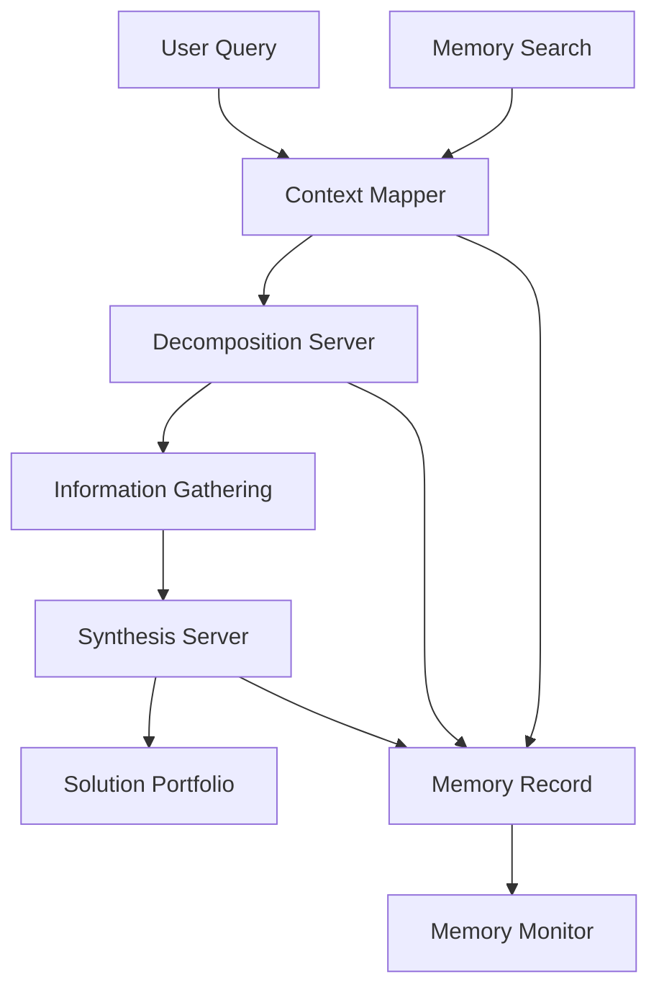

# 🏗️ SCA System Architecture

## Overview

SCA (Symbiotic Cognitive Architecture) implements a hierarchical cognitive framework designed for optimal human-AI collaboration.

## Core Components

### 1. Context Mapper Server
- **Purpose**: System-wide context analysis and relationship mapping
- **Input**: Raw queries and requirements
- **Output**: Mermaid diagrams and structural analysis

### 2. Decomposition Server  
- **Purpose**: Complex problem breakdown into actionable tasks
- **Input**: Analyzed context and requirements
- **Output**: Prioritized task hierarchy with dependencies

### 3. Synthesis Server
- **Purpose**: Dialectical integration of multiple perspectives
- **Input**: Multiple information sources and viewpoints
- **Output**: Synthesized solutions with confidence ratings

### 4. Memory System
- **Purpose**: Persistent learning and knowledge accumulation
- **Features**: TSL compression, semantic search, pattern recognition
- **Storage**: Hierarchical memory with automatic archiving

## Data Flow

## Integration Points

### MCP (Model Context Protocol)
- Standard-compliant server implementations
- Cross-platform compatibility
- Extensible tool interfaces

### Memory Augmented Learning (MAL)
- Continuous knowledge accumulation
- Efficient compression algorithms
- Semantic retrieval systems

## Deployment Architecture

### Development Environment
- Local development with hot reload
- Component testing framework
- Integration testing suite

### Production Environment
- VPS deployment with load balancing
- Automated scaling based on demand
- Comprehensive monitoring and logging

For detailed technical specifications, see [API Reference](API_REFERENCE.md).